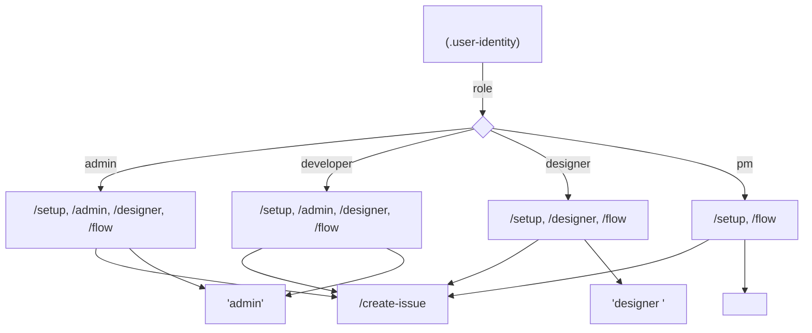

# Claude Code 

 **Service Flow Template** Claude Code .

```mermaid
graph TD
 A[" .claude/<br/>Claude Code "] -->|| B["commands/"]
 A -->|| C["agents/"]
 A -->|| D["hooks/"]
 A -->|| E["templates/"]
 A -->|| F["spec/"]
 A -->|| G["manifests/"]
 A -->|| H["settings.json"]

 B -->|5 | B1["setup.md<br/>admin.md<br/>designer.md<br/>flow.md<br/>create-issue.md"]

 C -->|3 | C1["pm.md<br/>Designer.md<br/>Developer.md"]

 D -->| | D1["startup.sh<br/>check-sync.sh"]

 E -->|PR/Issue| E1["pr-template.md<br/>issue-template.md"]

 F -->| | F1["component-spec.md<br/>flow-spec.md"]

 G -->| | G1["roles.yaml<br/>team.yaml<br/>theme.yaml"]
```

---

## 

### **commands/** — 
 Code . `/setup`, `/admin` .

| | | |
|------|------|---------|
| `setup.md` | (, GitHub) | |
| `admin.md` | | |
| `designer.md` | | `python3 scripts/designer.py` |
| `flow.md` | (Team ) | ** + Agent Team** |
| `create-issue.md` | | |

****: `/flow` Agent Team .

---

### **agents/** — 

 . `/flow` .

```mermaid
graph TB
 flow[" /flow <br/>PM "]

 flow -->| | pm[" pm.md<br/>PM Agent<br/>// "]
 flow -->| | designer[" designer.md<br/>Designer Agent<br/>//UX "]
 flow -->| | developer[" developer.md<br/>Developer Agent<br/>/ "]

 pm -->|| review[" "]
 designer -->|| review
 developer -->|| review

 review -->|| output[" <br/> <br/>PR "]
```

** **:
- **pm.md**: — , , 
- **designer.md**: — , UI , 
- **developer.md**: — API , , 

---

### **hooks/** — 

 .

| | | |
|------|--------|------|
| `startup.sh` | SessionStart ( ) | , git , |
| `check-sync.sh` | PreToolUse ( ) | Web-Native |
| `startup.ps1` | Windows | startup.sh PowerShell |

**startup.sh **:
```
1. (.user-identity)
2. GitHub (.gh-token)
3. (git skip-worktree)
4. Git (pull --rebase)
5. (check-sync.sh)
6. 
```

---

### **templates/** — PR/Issue 

 .

| | |
|------|------|
| `pr-template.md` | Pull Request |
| `issue-template.md` | GitHub Issue |

** **: PR .

---

### **spec/** — 

 .

| | |
|------|------|
| `component-spec.md` | (Props, , ) |
| `flow-spec.md` | |

****: `/designer` `/flow` .

---

### **manifests/** — 

, , .

| | |
|------|------|
| `roles.yaml` | (admin, developer, designer, pm) |
| `team.yaml` | |
| `theme.yaml` | Emocog |

****: `.gitignore` . PR .

---

### **settings.json** — Claude Code 

Claude Code .

** **:
```json
{
 "permissions": {
 "allow": [
 "Bash", // 
 "Read", "Write", // /
 "Task", // 
 "TaskCreate", "TaskUpdate", "TaskList", // 
 "TeamCreate", // 
 "SendMessage" // 
 ],
 "defaultMode": "acceptEdits" // 
 },
 "hooks": { ... },
 "env": {
 "CLAUDE_CODE_EXPERIMENTAL_AGENT_TEAMS": "1" // Agent Teams 
 }
}
```

---

## 

### **`/setup`** — (1)
```
1. 
2. (admin/developer/designer/pm)
3. GitHub 
4. .user-identity, .gh-token 
```

### **`/admin`** — (admin/developer)
```
1. 
2. (///)
3. git worktree 
4. 
5. CHANGELOG 
6. PR 
```

### **`/designer`** — (designer )
```
1. 
2. (Web/Native)
3. (/)
4. 
5. + 
6. Storybook (localhost:6006)
7. 
8. ( )
9. PR 
```

### **`/flow`** — ( ) 
```
1. PM ()
2. Agent Team 
 PM Agent ( )
 Designer Agent ( )
 Developer Agent ( )
3. 
4. 
5. (localhost:3000)
6. 
7. ( )
8. PR 
```

### **`/create-issue`** — ( )
```
1. 
2. 
3. 
4. gh issue create 
```

---

## 



---

## 

| | | |
|------|---------|------|
| `.user-identity` | git skip-worktree | |
| `.gh-token` | git skip-worktree | GitHub |
| `.claude/` | | |
| `flows/` (main) | .gitignore | |
| `flows/` (flow/*) | | |

---

## 

### ** **
1. `manifests/roles.yaml` 
2. `agents/` 
3. `settings.json` 

### ** **
1. `commands/{command-name}.md` `scripts/{command-name}.py` 
2. `startup.sh` 
3. `CLAUDE.md` 

### ** **
1. `manifests/theme.yaml` 
2. `components/theme/tokens.css` 
3. `components/theme/gluestack-theme.ts` 

---

## 

```bash
# 
cat .claude/agents/pm.md
cat .claude/agents/designer.md
cat .claude/agents/developer.md

# 
cat .claude/settings.json
cat .claude/manifests/roles.yaml

# 
bash .claude/hooks/check-sync.sh

# 
bash .claude/hooks/startup.sh
```

---

## 

 :
- [ ] `.user-identity` (`/setup` )
- [ ] `.gh-token` (GitHub )
- [ ] `npm install` ()
- [ ] `scripts/designer.py` (`python3 scripts/designer.py`)
- [ ] `npm run storybook` 
- [ ] `npm run dev` 
- [ ] Agent Teams (settings.json env )

---

## 

- [`CLAUDE.md`](../CLAUDE.md) — 
- [`agents/pm.md`](./agents/pm.md) — PM 
- [`agents/designer.md`](./agents/designer.md) — Designer 
- [`agents/developer.md`](./agents/developer.md) — Developer 
- [`spec/component-spec.md`](./spec/component-spec.md) — 
- [`spec/flow-spec.md`](./spec/flow-spec.md) — 
