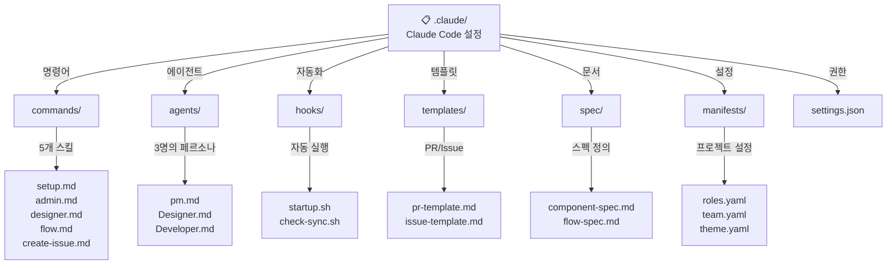
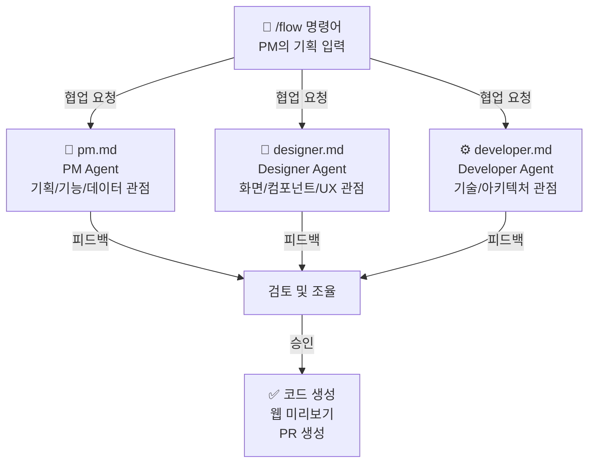
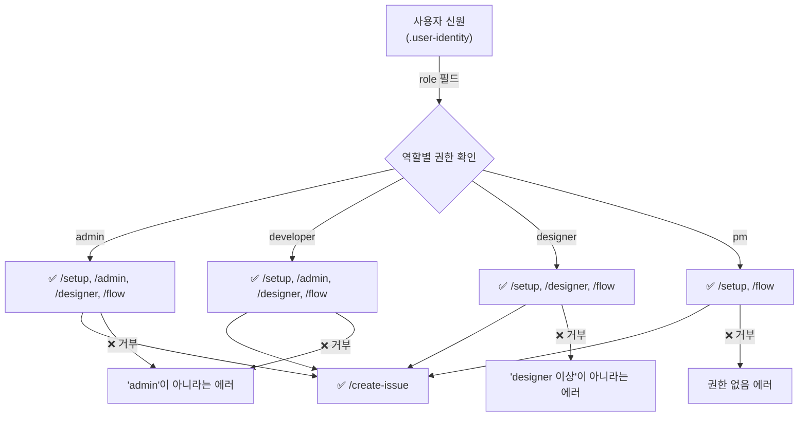

# 🎛️ Claude Code 설정 가이드

이 디렉토리는 **Service Flow Template**의 Claude Code 설정을 관리합니다.



---

## 📁 디렉토리별 역할

### **commands/** — 사용자 명령어
클라우드 Code의 기본 워크플로우를 정의합니다. 사용자가 `/setup`, `/admin` 등으로 실행할 수 있습니다.

| 파일 | 설명 | 실행 방식 |
|------|------|---------|
| `setup.md` | 초기 설정 (신원, GitHub) | 마크다운 지시사항 |
| `admin.md` | 템플릿 관리 | 마크다운 지시사항 |
| `designer.md` | 컴포넌트 생성 | `python3 scripts/designer.py` |
| `flow.md` | 플로우 생성 (Team 협업) | **마크다운 + Agent Team** |
| `create-issue.md` | 이슈 제보 | 마크다운 지시사항 |

**핵심**: `/flow` 명령어가 Agent Team 기반 협업 시스템의 진입점입니다.

---

### **agents/** — 에이전트 페르소나 ⭐

각 에이전트의 역할과 질문 스타일을 정의합니다. `/flow` 명령어에서 자동으로 호출됩니다.



**각 에이전트의 특징**:
- **pm.md**: 기획자 관점 — 사용자 흐름, 기능, 데이터 요구사항
- **designer.md**: 디자이너 관점 — 화면 구조, UI 컴포넌트, 반응형
- **developer.md**: 개발자 관점 — API 설계, 데이터베이스, 기술 스택

---

### **hooks/** — 자동화 스크립트

세션 시작 시 또는 특정 작업 전에 자동으로 실행됩니다.

| 파일 | 트리거 | 역할 |
|------|--------|------|
| `startup.sh` | SessionStart (세션 시작) | 사용자 신원 로드, git 동기화, 컴포넌트 확인 |
| `check-sync.sh` | PreToolUse (파일 수정 전) | Web-Native 컴포넌트 동기화 검증 |
| `startup.ps1` | Windows 환경 | startup.sh의 PowerShell 버전 |

**startup.sh 동작**:
```
1. 사용자 신원 확인 (.user-identity)
2. GitHub 토큰 로드 (.gh-token)
3. 로컬 파일 보호 (git skip-worktree)
4. Git 동기화 (pull --rebase)
5. 컴포넌트 동기화 확인 (check-sync.sh)
6. 상태 리포트 출력
```

---

### **templates/** — PR/Issue 템플릿

코드 변경사항 제출 시 사용됩니다.

| 파일 | 용도 |
|------|------|
| `pr-template.md` | Pull Request 본문 템플릿 |
| `issue-template.md` | GitHub Issue 템플릿 |

**자동 적용**: 새 PR 생성 시 자동으로 포함됩니다.

---

### **spec/** — 규칙 및 스펙

프로젝트 전체 개발 기준을 정의합니다.

| 파일 | 내용 |
|------|------|
| `component-spec.md` | 컴포넌트 생성 규칙 (Props, 스타일, 접근성) |
| `flow-spec.md` | 서비스 플로우 구조 및 패턴 |

**참고**: `/designer` 및 `/flow` 명령어에서 자동 검증됩니다.

---

### **manifests/** — 프로젝트 설정

팀, 권한, 테마를 중앙 집중식으로 관리합니다.

| 파일 | 내용 |
|------|------|
| `roles.yaml` | 역할별 권한 정의 (admin, developer, designer, pm) |
| `team.yaml` | 팀원 명단 및 메타데이터 |
| `theme.yaml` | Emocog 테마 설정 |

**주의**: `.gitignore`에 의해 로컬에서만 사용됩니다. 변경 시 PR을 통해 공유합니다.

---

### **settings.json** — Claude Code 권한

Claude Code의 실행 권한과 환경을 정의합니다.

**주요 설정**:
```json
{
  "permissions": {
    "allow": [
      "Bash",           // 터미널 명령어
      "Read", "Write",  // 파일 읽기/쓰기
      "Task",           // 백그라운드 작업
      "TaskCreate", "TaskUpdate", "TaskList",  // 작업 관리
      "TeamCreate",     // 에이전트 팀 생성
      "SendMessage"     // 에이전트 간 메시지
    ],
    "defaultMode": "acceptEdits"  // 편집 자동 승인
  },
  "hooks": { ... },
  "env": {
    "CLAUDE_CODE_EXPERIMENTAL_AGENT_TEAMS": "1"  // Agent Teams 활성화
  }
}
```

---

## 🚀 명령어 실행 흐름

### **`/setup`** — 초기 설정 (1회만)
```
1. 사용자 이름 입력
2. 역할 선택 (admin/developer/designer/pm)
3. GitHub 정보 입력
4. .user-identity, .gh-token 파일 생성
```

### **`/admin`** — 템플릭 관리 (admin/developer만)
```
1. 권한 확인
2. 관리 옵션 선택 (스펙/팀원/테마/권한)
3. git worktree 생성
4. 파일 수정
5. CHANGELOG 업데이트
6. PR 자동 생성
```

### **`/designer`** — 컴포넌트 생성 (designer 이상)
```
1. 권한 확인
2. 프레임워크 선택 (Web/Native)
3. 액션 선택 (생성/수정)
4. 컴포넌트 정보 입력
5. 코드 생성 + 스토리 파일 자동 생성
6. Storybook 실행 (localhost:6006)
7. 브라우저 자동 띄우기
8. 사용자 검증 (상호작용 확인)
9. PR 자동 생성
```

### **`/flow`** — 플로우 생성 (모든 역할) ⭐
```
1. PM이 기획 입력 (바이브코딩)
2. Agent Team 자동 생성
   ├─ PM Agent (기획 검토)
   ├─ Designer Agent (화면 설계)
   └─ Developer Agent (기술 검토)
3. 각 에이전트가 자신의 관점에서 피드백 제공
4. 최종 조율 및 코드 생성
5. 웹 서버 실행 (localhost:3000)
6. 브라우저 자동 띄우기
7. 사용자 검증 (플로우 테스트)
8. PR 자동 생성
```

### **`/create-issue`** — 이슈 제보 (모든 역할)
```
1. 제목 입력
2. 내용 입력
3. 키워드 기반 라벨 자동 추가
4. gh issue create 실행
```

---

## 🔄 권한 흐름



---

## 📊 파일 보호 전략

| 파일 | 보호 방법 | 용도 |
|------|---------|------|
| `.user-identity` | git skip-worktree | 로컬 사용자 정보 |
| `.gh-token` | git skip-worktree | GitHub 인증 토큰 |
| `.claude/` | 버전 관리 | 팀 공유 설정 |
| `flows/` (main) | .gitignore | 로컬에서만 사용 |
| `flows/` (flow/*) | 추적됨 | 브랜치에서 공유 |

---

## 🛠️ 커스터마이징 가이드

### **역할 추가**
1. `manifests/roles.yaml` 편집
2. `agents/` 폴더에 새 에이전트 페르소나 생성
3. `settings.json` 권한 업데이트

### **명령어 추가**
1. `commands/{command-name}.md` 또는 `scripts/{command-name}.py` 생성
2. `startup.sh`에 새 명령어 공지 추가
3. `CLAUDE.md`에 문서화

### **테마 변경**
1. `manifests/theme.yaml` 편집
2. `components/theme/tokens.css` 업데이트
3. `components/theme/gluestack-theme.ts` 동시 업데이트

---

## ⚡ 자주 사용하는 명령어

```bash
# 에이전트 페르소나 확인
cat .claude/agents/pm.md
cat .claude/agents/designer.md
cat .claude/agents/developer.md

# 설정 확인
cat .claude/settings.json
cat .claude/manifests/roles.yaml

# 수동으로 동기화 확인
bash .claude/hooks/check-sync.sh

# 상태 리포트
bash .claude/hooks/startup.sh
```

---

## ✅ 체크리스트

프로젝트 설정 완료 확인:
- [ ] `.user-identity` 파일 생성 (`/setup` 실행)
- [ ] `.gh-token` 파일 생성 (GitHub 토큰)
- [ ] `npm install` 완료 (의존성)
- [ ] `scripts/designer.py` 실행 가능 (`python3 scripts/designer.py`)
- [ ] `npm run storybook` 실행 가능
- [ ] `npm run dev` 실행 가능
- [ ] Agent Teams 활성화 (settings.json의 env 확인)

---

## 📚 관련 문서

- [`CLAUDE.md`](../CLAUDE.md) — 프로젝트 전체 가이드
- [`agents/pm.md`](./agents/pm.md) — PM 에이전트 페르소나
- [`agents/designer.md`](./agents/designer.md) — Designer 에이전트 페르소나
- [`agents/developer.md`](./agents/developer.md) — Developer 에이전트 페르소나
- [`spec/component-spec.md`](./spec/component-spec.md) — 컴포넌트 규칙
- [`spec/flow-spec.md`](./spec/flow-spec.md) — 플로우 규칙
