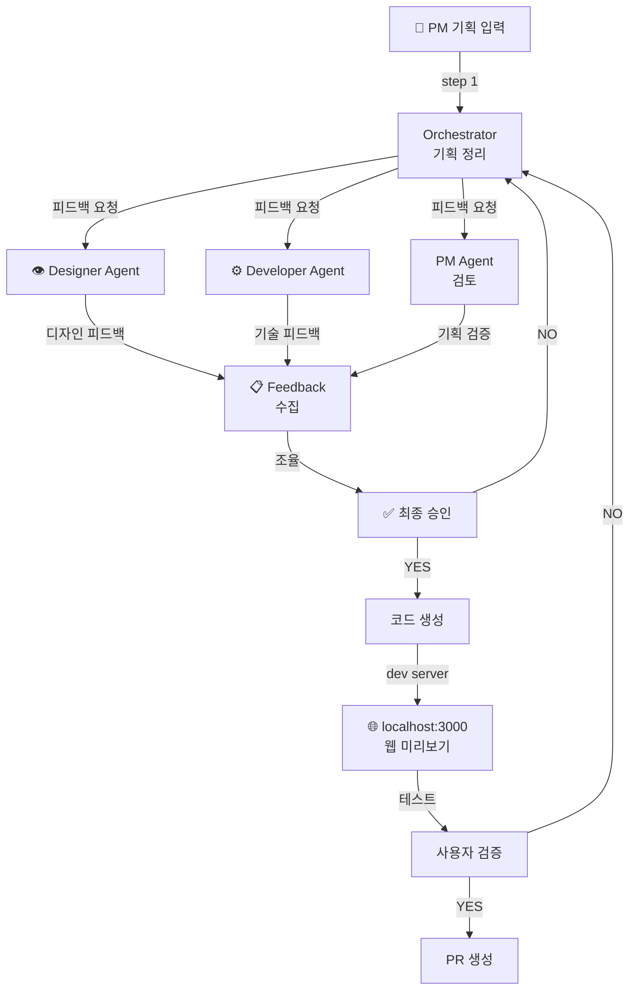

# /flow — 서비스 플로우 생성 (Agent Team 협업)

## 개요

**PM, Designer, Developer의 협업으로 완전한 서비스 플로우를 설계·구현합니다.**

- 사용자(PM)가 기획 입력
- Designer가 화면 구조 제안
- Developer가 기술 검토
- 모두 승인하면 코드 생성 → 웹 미리보기 → PR

**권한**: 모든 역할 (admin, developer, designer, pm)

**특징**:
- 각 직군이 자신의 언어로 소통
- 다각적 검토로 품질 보증
- 자동 웹 미리보기
- PR 자동 생성

---

## Claude 실행 지시

이 명령을 실행할 때 Claude가 따라야 할 단계:

1. 선행 조건 확인:
   - `.user-identity` 파일 존재 여부 확인
   - 없으면 Skill("setup") 먼저 실행
   - Git 동기화: `git pull --rebase`

2. 제품명 입력 (AskUserQuestion):
   - 예: user-onboarding, payment-flow, product-dashboard
   - 프로젝트 선택 또는 신규 프로젝트 생성 옵션 제공

3. 브랜치 자동 생성:
   - `git checkout -b flow/{product-name}` (main에서 분기)

4. 플로우 설명 입력 (자유 형식):
   - 사용자로부터 기획/기능 설명 수집

5. Agent Team 협업:
   - Orchestrator(PM 관점): 기획 정리
   - Designer Agent: 화면/UX 피드백
   - Developer Agent: 기술 검토
   - 각 에이전트의 피드백 수집 → 최종 조율

6. 코드 생성:
   - flows/{product-name}/ 디렉토리 생성
   - 화면 파일, Context, 네비게이션 구현
   - `spec/flow-spec.md` 규칙 준수

7. 웹 미리보기 (선택):
   - 포트 3000 확인 및 정리 (필요 시)
   - 개발 서버 시작
   - 브라우저에서 http://localhost:3000 열기

8. 사용자 검증 후 PR 생성:
   - 제목: [flow] {사용자명}: {product-name} 서비스 플로우
   - flows/ .gitignore 해제: `git update-index --no-skip-worktree flows/`
   - PR 자동 생성

---

## 워크플로우



---

## 단계별 실행

### 1단계: 신원 확인

```
✅ 신원: 김기획 (pm)
✅ 권한: 플로우 작업 가능
```

### 2단계: 제품명 입력

```
🛍️  제품명을 입력하세요 (예: my-awesome-app):
> user-onboarding
```

**브랜치 자동 생성**:
```
🌿 flow/user-onboarding 브랜치 생성 (main에서 분기)
```

### 3단계: 플로우 설명 입력 (바이브코딩)

```
📝 서비스 플로우를 자유롭게 설명해주세요:
> 사용자가 앱에 처음 가입할 때
> 1) 이메일 입력 → 검증
> 2) 프로필 정보 입력 (이름, 사진)
> 3) 구독 플랜 선택
> 4) 결제 정보 입력
> 5) 가입 완료 및 홈 화면

총 5개 화면, 선형 플로우입니다.
```

### 4단계: 화면 설계

```
🎨 화면 설계를 시작합니다...

1️⃣  화면 1: 이메일 입력
==================

화면 제목:
> Email Signup

화면 설명:
> 사용자 이메일 주소 입력 및 검증

필요한 컴포넌트:
- Input (이메일)
- Button (다음)
- Text (설명)

컴포넌트 자동 검색 완료!

✅ 사용 가능 컴포넌트:
  - Input.tsx (components/web/Input.tsx)
  - Button.tsx (components/web/Button.tsx)

컴포넌트 선택:
  1. Input (이메일 입력)
  2. Button (다음 버튼)
  3. Card (배경)

추가 컴포넌트? (y/n):
> n

2️⃣  화면 2: 프로필 정보
==================

화면 제목:
> Profile Information

화면 설명:
> 사용자 프로필 정보 입력 (이름, 사진)

필요한 컴포넌트:
- Input (이름)
- FileInput (사진)
- Button (다음)
- Card (배경)

[계속...]
```

### 5단계: 네비게이션 설정

```
🗺️  네비게이션을 설정합니다...

네비게이션 유형:
  1. 선형 (Linear) — 이전/다음으로 진행 ✅ (선택)
  2. 탭 (Tabs) — 탭으로 이동
  3. 모달 (Modals) — 팝업 형태
  4. 혼합 (Mixed) — 여러 방식 조합

선택:
> 1

✅ 네비게이션 구조:
Screen 1 → Screen 2 → Screen 3 → Screen 4 → Screen 5

각 화면 간 조건부 분기? (y/n):
> n

데이터 유지 방식:
  1. Context API + Hooks
  2. LocalStorage
  3. 모두

선택:
> 1
```

### 6단계: 데이터 플로우 정의

```
📊 데이터 플로우를 정의합니다...

1️⃣  전역 상태 (Context):

formData:
  - email: string
  - name: string
  - photo: File
  - planType: 'free' | 'premium'
  - paymentInfo: { ... }

currentStep: number

2️⃣  API 호출:

POST /api/signup
  Input: { email, name, photo }
  Output: { userId, token }

POST /api/confirm-subscription
  Input: { userId, planType, paymentInfo }
  Output: { subscriptionId }

3️⃣  상태 관리:
- 각 화면은 formData 업데이트
- 다음 화면으로 진행 시 유효성 검증
- 에러 발생 시 해당 화면에서 처리
```

### 7단계: 코드 생성

```
✨ 코드를 생성합니다...

생성 중:
  ✅ flow/user-onboarding/page.tsx
  ✅ flow/user-onboarding/layout.tsx
  ✅ flow/user-onboarding/contexts/FlowContext.tsx
  ✅ flow/user-onboarding/types/index.ts
  ✅ flow/user-onboarding/screens/Screen1.tsx
  ✅ flow/user-onboarding/screens/Screen2.tsx
  ✅ flow/user-onboarding/screens/Screen3.tsx
  ✅ flow/user-onboarding/screens/Screen4.tsx
  ✅ flow/user-onboarding/screens/Screen5.tsx
  ✅ flow/user-onboarding/hooks/useNavigation.ts
  ✅ flow/user-onboarding/README.md

========================
✅ 플로우 생성됨!

📍 위치: flows/user-onboarding/
📊 파일 수: 11개

프로젝트 구조:
flows/user-onboarding/
├── page.tsx
├── layout.tsx
├── contexts/
│   └── FlowContext.tsx
├── types/
│   └── index.ts
├── screens/
│   ├── Screen1.tsx
│   ├── Screen2.tsx
│   ├── Screen3.tsx
│   ├── Screen4.tsx
│   └── Screen5.tsx
├── hooks/
│   └── useNavigation.ts
└── README.md
```

### 8단계: 개발 서버 시작 (선택)

```
🚀 개발 서버를 시작하시겠습니까? (y/n):
> y

개발 서버 시작 중...
✅ http://localhost:3000 에서 실행 중

이제 플로우를 테스트할 수 있습니다!
```

### 9단계: PR 생성

```
🔄 PR 생성을 시작합니다...

1️⃣  PR 정보:
제목: [flow] 김기획: user-onboarding 서비스 플로우
분기: flow/user-onboarding → main

2️⃣  변경 파일:
- flows/user-onboarding/* (11개 파일)

3️⃣  PR 옵션:
제목 수정? (y/n): n
본문 수정? (y/n): n
드래프트로 생성? (y/n): n

========================
✅ PR이 생성되었습니다!

📍 PR 링크: https://github.com/{owner}/{repo}/pull/456
📌 상태: Open (리뷰 대기 중)

플로우를 다른 팀원과 공유할 수 있습니다.
```

---

## 브랜치 및 PR 프로세스

### 브랜치 구조

```
main (템플릿 + 컴포넌트 라이브러리)
├── flow/user-onboarding (사용자 온보딩)
├── flow/payment-flow (결제 플로우)
└── flow/product-dashboard (상품 대시보드)
```

### PR 공유 프로세스

1. **로컬에서 개발**: `flow/{product-name}` 브랜치에서 작업
2. **PR 생성**: 자동으로 PR 생성
3. **리뷰**: admin/developer가 코드 리뷰
4. **수정**: 리뷰 댓글 반영
5. **병합**: main 브랜치로 병합

### flows/ gitignore 관리

- **main에서**: `flows/`는 `.gitignore`에 포함 (플로우 추적 안함)
- **flow/* 브랜치에서**: `flows/`가 추적됨 (git에 커밋됨)

**수동 해제 (필요 시)**:
```bash
git update-index --no-skip-worktree flows/
```

---

## 플로우 구조 상세

### 1. Root Page (`page.tsx`)

```typescript
'use client'

import React from 'react'
import { FlowProvider } from './contexts/FlowContext'
import ScreenContainer from './components/ScreenContainer'

export default function FlowPage() {
  return (
    <FlowProvider>
      <ScreenContainer />
    </FlowProvider>
  )
}
```

### 2. Context (`contexts/FlowContext.tsx`)

```typescript
import React, { createContext, useContext, useState } from 'react'

interface FlowContextType {
  currentStep: number
  formData: Record<string, any>
  navigateTo: (step: number) => void
  updateFormData: (data: Partial<FlowContextType['formData']>) => void
}

const FlowContext = createContext<FlowContextType | undefined>(undefined)

export const FlowProvider: React.FC<{ children: React.ReactNode }> = ({
  children,
}) => {
  // ... 구현
}
```

### 3. Screens (`screens/Screen*.tsx`)

```typescript
'use client'

import React from 'react'
import { useFlow } from '../contexts/FlowContext'
import { Input, Button, Card } from '@/components/web'

export default function Screen1() {
  const { updateFormData, navigateTo } = useFlow()
  const [email, setEmail] = React.useState('')

  const handleNext = () => {
    updateFormData({ email })
    navigateTo(1)
  }

  return (
    <Card>
      <h1>이메일 입력</h1>
      <Input
        type="email"
        placeholder="이메일 주소"
        value={email}
        onChange={(e) => setEmail(e.target.value)}
      />
      <Button onClick={handleNext}>다음</Button>
    </Card>
  )
}
```

---

## 모범 사례

### ✅ 좋은 플로우

- 각 화면이 하나의 작업에 집중
- 명확한 이전/다음 네비게이션
- 데이터가 Context에서 관리됨
- 에러 처리가 구현됨
- 반응형 디자인

### ❌ 나쁜 플로우

- 화면이 너무 많은 책임을 가짐
- 복잡한 네비게이션 규칙
- 전역 상태 없이 컴포넌트가 데이터 관리
- 에러 처리 누락
- 하드코딩된 값

---

## 체크리스트

완성 전 확인:

- [ ] 모든 화면이 생성되었습니다
- [ ] Context 상태 관리가 구현되었습니다
- [ ] 네비게이션이 작동합니다
- [ ] 데이터 플로우가 명확합니다
- [ ] API 호출이 처리됩니다 (필요 시)
- [ ] 에러 처리가 구현되었습니다
- [ ] 반응형 디자인이 적용되었습니다
- [ ] 접근성(ARIA)이 충족되었습니다
- [ ] README.md가 작성되었습니다
- [ ] PR 템플릿을 사용했습니다

---

## 참고

- [플로우 스펙](../spec/flow-spec.md)
- [컴포넌트 스펙](../spec/component-spec.md)
- [PR 템플릿](../templates/pr-template.md)
- [Next.js App Router](https://nextjs.org/docs/app)
- [React Context API](https://react.dev/reference/react/useContext)
